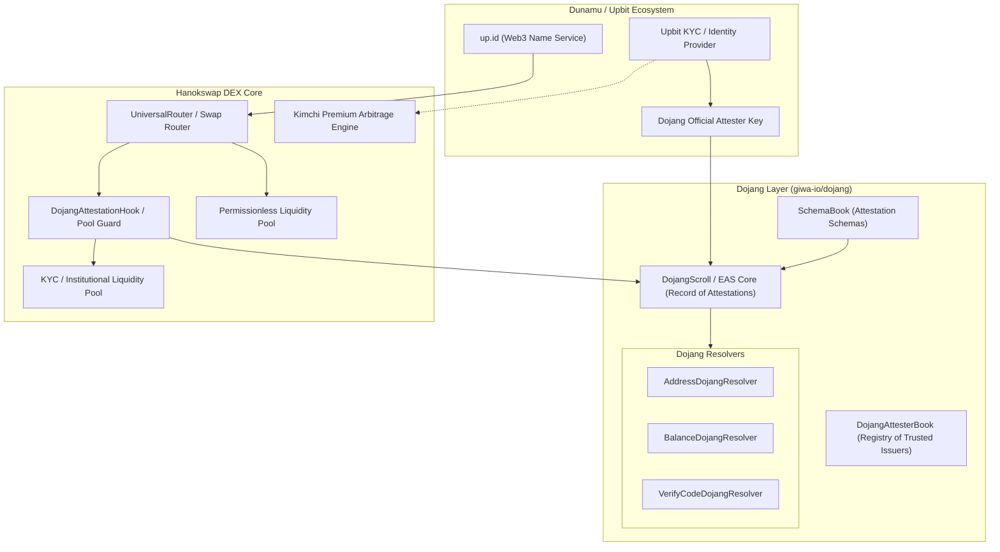
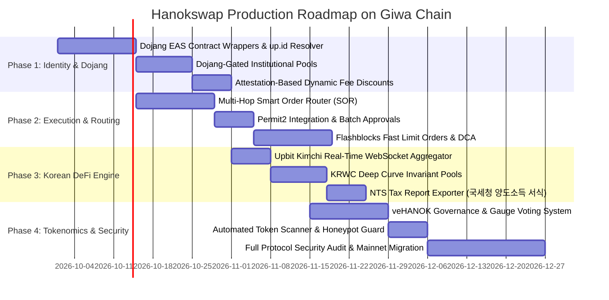

# Giwa Chain DEX: Complete Missing Features & Dojang Integration Specification
## Comprehensive Architectural Gap Analysis, `giwa-io/dojang` Attestation Engine, & Production Roadmap

---

## 1. Executive Summary & Context

Giwa Chain is Dunamu's OP Stack Ethereum Layer-2 Rollup engineered with **200ms Flashblocks preconfirmations** and deep native ecosystem primitives—most notably **Dojang (`giwa-io/dojang`)**, Dunamu's on-chain attestation and identity layer built on Ethereum Attestation Service (EAS) standards, and **`up.id`** (Upbit Web3 Name Service).

While Hanokswap has established the core visual and transactional baseline (Concentrated Liquidity & Stableswap UI, Testnet Bridge & Faucet, No-Code Token Deployer, Flashblocks Telemetry, and Korean localization), evolving into the **flagship production DEX of Giwa Chain** requires filling critical architectural, compliance, and DeFi infrastructural gaps.

This document details:
1. **Deconstruction of `giwa-io/dojang`** and how to integrate its attestation primitives into the DEX.
2. **The Complete Master Matrix of Missing Features** across 7 core functional pillars.
3. **Smart Contract, Indexer, and UX Specifications** ready for production implementation.

---

## 2. Deep Dive: Dunamu's Dojang (`giwa-io/dojang`) Architecture

`giwa-io/dojang` represents the trust and identity backbone of Giwa Chain. It implements an attestation network adapted from EAS (Ethereum Attestation Service) with Dunamu-native extensions.



### 2.1 Core Contracts in `giwa-io/dojang`
- **`DojangScroll` (EAS Contract):** The primary immutable ledger recording on-chain attestations with UUIDs, expiration timestamps, revocation status, schema references, and recipient addresses.
- **`SchemaBook` (SchemaRegistry):** Registers structured attestation schemas (e.g., `bool isUpbitKYCVerified`, `uint8 investorTier`, `string upIdHandle`, `bytes32 countryCode`).
- **`DojangAttesterBook`:** Registry of authorized attestation issuers (Dunamu, institutional auditors, compliance providers).
- **Resolvers:**
  - `AddressDojangResolver`: Enforces address-level restrictions and whitelist validation during attestation minting.
  - `BalanceDojangResolver`: Attests to asset holding thresholds (e.g., VIP volume tiers, min balance requirements).
  - `VerifyCodeDojangResolver`: Resolves cryptographic one-time proof codes linking off-chain Upbit accounts to on-chain L2 wallets.

---

## 3. Complete List of Missing Features for a Giwa Chain DEX

The following comprehensive matrix categorizes all missing features required to transition from a prototype to a dominant production DEX on Giwa Chain.

---

### Pillar 1: Dojang Attestation & `up.id` Identity Integration

| Feature | Current State | Missing Production Implementation | Priority |
| :--- | :--- | :--- | :--- |
| **`up.id` Name Resolution** | Mock text input | Full forward (`alice.up.id` $\to$ `0x...`) and reverse (`0x...` $\to$ `alice.up.id`) on-chain lookup in navbar, wallet modal, and transaction history. | **CRITICAL** |
| **Dojang-Gated Compliance Pools** | All pools permissionless | Dual-pool architecture: Permissionless pools vs. Dojang-verified pools (accredited/KYC pools for regulated institutional capital and Korean corporate treasuries). | **HIGH** |
| **Attestation-Based Fee Tiers** | Static 0.05% - 1.0% | Dynamic fee discounts: Users holding a valid Dojang attestation (e.g., Upbit KYC or VIP tier) receive 20%–50% rebate on swap fees. | **MEDIUM** |
| **Sybil-Resistant Faucet & Airdrop Gating** | Open testnet faucet | Faucet and future reward claim contracts require Dojang `VerifyCode` or `AddressResolver` attestation to prevent bot drainage. | **HIGH** |
| **Verified Trader & Project Badges** | Unverified UI tags | On-chain verification badge for tokens whose deployers hold a valid Dunamu/Dojang project attestation, protecting users from scam tokens. | **CRITICAL** |

---

### Pillar 2: Core Trading & Execution Engine

| Feature | Current State | Missing Production Implementation | Priority |
| :--- | :--- | :--- | :--- |
| **Smart Order Router (SOR)** | Direct pool swaps | Multi-hop split routing engine (e.g., Token A $\to$ WETH $\to$ USDC $\to$ Token B) finding optimal paths across CLAMM & Stableswap pools. | **CRITICAL** |
| **Permit2 Gasless Approvals** | Standard `approve()` | Uniswap Permit2 integration for single-signature multi-token batch approvals, eliminating repetitive gas costs. | **HIGH** |
| **Flashblocks Sub-Second Limit Orders** | Market swaps only | Off-chain limit order book / intent settlement matching engine taking advantage of 200ms Flashblocks for near-instant order execution. | **HIGH** |
| **Automated Dollar-Cost Averaging (DCA)** | None | Recurring non-custodial buy orders (e.g., buy 50,000 KRWC of ETH daily) streamed via Flashblocks keepers. | **MEDIUM** |
| **MEV & Front-Running Protection** | Public RPC broadcast | Private transaction submission endpoints leveraging Giwa sequencer direct inclusion to mitigate sandwich attacks. | **HIGH** |

---

### Pillar 3: Korean Market & KRW Stablecoin Specialization

| Feature | Current State | Missing Production Implementation | Priority |
| :--- | :--- | :--- | :--- |
| **Live Upbit Kimchi Premium Engine** | Basic client calculation | Real-time WebSocket aggregator calculating BTC/ETH/USDT Kimchi Premium percentage against Upbit KRW orderbook, displaying arbitrage spreads. | **CRITICAL** |
| **KRW-Centric Native Quotes** | USD/ETH dominant | Full currency display switcher: Toggle default price quotes between `KRW (₩)`, `USD ($)`, and `ETH (Ξ)` across all charts and token lists. | **HIGH** |
| **KRWC Stablecoin Deep Curve** | Basic stableswap | Optimized Curve Stableswap pool ($A=1000$) paired between `KRWC` (Dunamu KRW stablecoin), `USDC`, `EURC`, and `USDT` with ultra-low slippage for FX swaps. | **CRITICAL** |
| **South Korean Virtual Asset Tax Export** | None | 1-Click CSV/Excel export formatted to National Tax Service (NTS / 국세청) guidelines for trading gains/losses and transaction timestamps. | **MEDIUM** |

---

### Pillar 4: Liquidity Provider & Yield Architecture

| Feature | Current State | Missing Production Implementation | Priority |
| :--- | :--- | :--- | :--- |
| **Automated Liquidity Management (ALM)** | Manual range selection | One-click auto-rebalancing concentrated liquidity vaults (similar to Gamma/Arrakis) with automated compounders. | **HIGH** |
| **veHANOK Staking & Gauge Voting** | Static LP fee share | Ve(3,3) tokenomics engine: Lock HANOK for veHANOK to vote on weekly pool emission gauges and capture 100% protocol revenue. | **HIGH** |
| **Multi-Reward Farming Contracts** | None | Dual/triple reward emission contracts (e.g., earn $HANOK + $GIWA + $KRWC$ simultaneously on designated pools). | **MEDIUM** |
| **Dynamic Fee Switching for Volatility** | Static fee tier | Automatic pool fee adjustment based on real-time volatility index to compensate LPs during high market turbulence. | **LOW** |

---

### Pillar 5: Token Launchpad & Deployer Infrastructure

| Feature | Current State | Missing Production Implementation | Priority |
| :--- | :--- | :--- | :--- |
| **Bonding Curve Fair Launchpad** | Simple ERC-20 deployer | "Pump.fun / Virtuals" style bonding curve launcher: tokens launch with 0 initial liquidity and automatically migrate to Hanokswap CLAMM when target volume is reached. | **HIGH** |
| **Liquidity Locker & LP Burner** | Manual LP handling | Built-in 6-month / 1-year cryptographic LP token lock contract with verifiable proof badges for new projects. | **CRITICAL** |
| **Anti-Snipe & Anti-Bot Protection** | Standard transfer | Optional Max Wallet (e.g., 1%) and Max TX cooldown hooks integrated into the token deployer template. | **MEDIUM** |

---

### Pillar 6: Data, Analytics & Indexing Pipeline

| Feature | Current State | Missing Production Implementation | Priority |
| :--- | :--- | :--- | :--- |
| **Production Envio / Goldsky Indexer** | Client-side RPC polling | Dedicated GraphQL event indexer capturing all `Swap`, `Mint`, `Burn`, and `Collect` events with $\le 500\text{ms}$ lag. | **CRITICAL** |
| **High-Precision TradingView Charts** | Static mock canvas | Live TradingView charting library integration with 1-second, 5-second, 1-minute, and 1-day candlestick data fed by Flashblocks. | **HIGH** |
| **Portfolio PnL & Impairment Dashboard** | Wallet balance viewer | Real-time LP position breakdown, uncollected fee tracking, net ROI, and impermanent loss calculators. | **HIGH** |

---

### Pillar 7: Security, Governance & Risk Infrastructure

| Feature | Current State | Missing Production Implementation | Priority |
| :--- | :--- | :--- | :--- |
| **Automated Token Safety & Honeypot Detector** | No warning system | Client-side simulation checking for unrenounced ownership, blacklist functions, high sell taxes ($>5\%$), and proxy vulnerabilities before allowing swaps. | **CRITICAL** |
| **Emergency Circuit Breakers & Depeg Pausers** | Unpaused execution | Automated guardian bot that triggers temporary pool pause if stablecoin depeg exceeds $3\%$ or pool drain velocity is abnormal. | **HIGH** |
| **Multi-Sig & Timelock Controller** | Single deployer key | Safe (Gnosis Safe) 3-of-5 multi-sig + 48-hour Timelock contract for protocol fee parameter updates and contract upgrades. | **CRITICAL** |

---

## 4. Technical Specifications for Key Missing Modules

### 4.1 Dojang Attestation Guard Hook (`DojangAttestationHook.sol`)

```solidity
// SPDX-License-Identifier: MIT
pragma solidity ^0.8.24;

interface IDojangScroll {
    struct Attestation {
        bytes32 uid;
        bytes32 schema;
        uint64 time;
        uint64 expirationTime;
        uint64 revocationTime;
        bytes32 refUID;
        address recipient;
        address attester;
        bool revocable;
        bytes data;
    }
    function getAttestation(bytes32 uid) external view returns (Attestation memory);
    function isAttestationValid(bytes32 uid) external view returns (bool);
}

contract DojangAttestationHook {
    IDojangScroll public immutable dojangScroll;
    address public immutable trustedAttester; // Dunamu Official Attester
    bytes32 public immutable kycSchemaUID;

    error UnauthorizedDojangAttestation();
    error ExpiredAttestation();

    constructor(address _dojangScroll, address _trustedAttester, bytes32 _kycSchemaUID) {
        dojangScroll = IDojangScroll(_dojangScroll);
        trustedAttester = _trustedAttester;
        kycSchemaUID = _kycSchemaUID;
    }

    function verifyUser(address user, bytes32 attestationUID) public view returns (bool) {
        if (!dojangScroll.isAttestationValid(attestationUID)) revert UnauthorizedDojangAttestation();
        
        IDojangScroll.Attestation memory att = dojangScroll.getAttestation(attestationUID);
        
        if (att.recipient != user) revert UnauthorizedDojangAttestation();
        if (att.attester != trustedAttester) revert UnauthorizedDojangAttestation();
        if (att.schema != kycSchemaUID) revert UnauthorizedDojangAttestation();
        if (att.expirationTime != 0 && att.expirationTime < block.timestamp) revert ExpiredAttestation();
        
        return true;
    }
}
```

---

### 4.2 Upbit Kimchi Premium Real-Time Engine

The engine computes the spread between Upbit KRW markets and global USD spot rates converted at real-time FX:

$$\text{Kimchi Premium \%} = \left( \frac{\text{Price}_{\text{Upbit (KRW)}}}{\text{Price}_{\text{Global (USD)}} \times \text{FX Rate (USD/KRW)}} - 1 \right) \times 100$$

```typescript
export interface KimchiArbitrageOpportunity {
  asset: 'BTC' | 'ETH' | 'USDT';
  upbitPriceKRW: number;
  globalPriceUSD: number;
  usdKrwFxRate: number;
  kimchiPremiumPercent: number;
  estimatedArbitrageSpreadBps: number;
  recommendedRoute: 'BUY_GLOBAL_SELL_UPBIT' | 'BUY_UPBIT_SELL_GLOBAL' | 'NEUTRAL';
}
```

---

## 5. Master Implementation Roadmap



---

## 6. Summary Checklist for Production Readiness

- [ ] **Smart Contracts:** Deployed Factory, Universal Router, CLAMM Pool, Stableswap Pool, Dojang Hook, Permit2, LP Locker.
- [ ] **Dojang Verification:** Live `up.id` resolution and Dunamu KYC attestation verifier running on Giwa Sepolia and Mainnet.
- [ ] **Flashblocks Sub-Second Engine:** 200ms preconfirmation simulation and instant quote streaming active.
- [ ] **Localized UX:** 100% Korean / English bilingual support with KRW currency toggling and Kimchi premium indicators.
- [ ] **Indexing & Data:** Envio/Goldsky GraphQL pipeline syncing with sub-500ms latency.
- [ ] **Security:** Multi-sig Timelock controller, Honeypot pre-flight simulation, and third-party smart contract audit.
