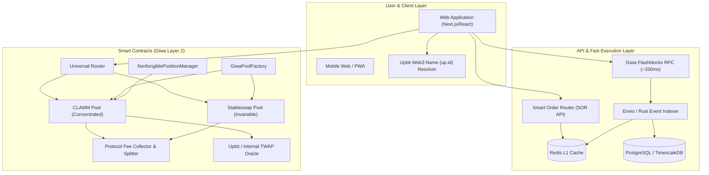
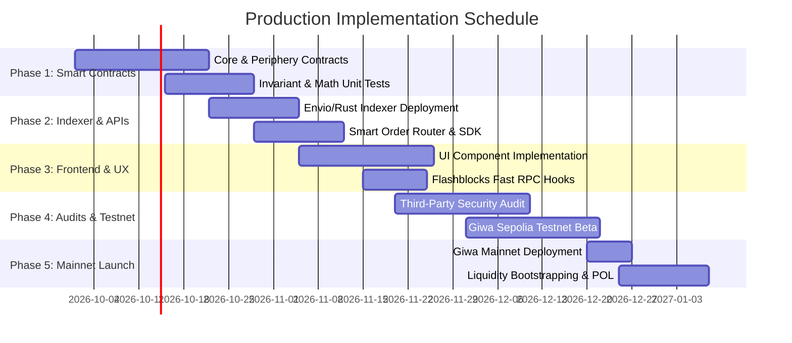

# Production-Grade DEX & Token Swap Protocol on Giwa Chain
## Enterprise System Architecture, Technical Deliverables & Production Blueprint

---

## Document Information
- **Target Network:** Giwa Chain (Dunamu's OP Stack Ethereum Layer-2 Rollup)
- **Testnet Chain ID:** `91342` (`0x164ce` - Giwa Sepolia)
- **Document Version:** `1.0.0-PROD`
- **Target Audience:** Blockchain Architects, Smart Contract Engineers, DevOps, Security Auditors, Product Managers, and Protocol Investors.

---

## Table of Contents
1. [Phase 1: Requirements Discovery & Giwa Technical Baseline](#phase-1-requirements-discovery--giwa-technical-baseline)
2. [Phase 2: Solution Architecture](#phase-2-solution-architecture)
   - [2.1 Executive Summary](#21-executive-summary)
   - [2.2 High-Level Architecture Diagram](#22-high-level-architecture-diagram)
   - [2.3 DEX Model Selection & Tradeoffs](#23-dex-model-selection--tradeoffs)
   - [2.4 Smart Contract Architecture](#24-smart-contract-architecture)
   - [2.5 Liquidity System & Flashblocks Optimization](#25-liquidity-system--flashblocks-optimization)
   - [2.6 Cross-Chain & Interoperability Design](#26-cross-chain--interoperability-design)
   - [2.7 Security Architecture & Threat Model](#27-security-architecture--threat-model)
   - [2.8 Backend Infrastructure & Indexer Pipeline](#28-backend-infrastructure--indexer-pipeline)
   - [2.9 Frontend Architecture & UX Flows](#29-frontend-architecture--ux-flows)
   - [2.10 DevOps, CI/CD & Monitoring Stack](#210-devops-cicd--monitoring-stack)
   - [2.11 Protocol Tokenomics & Revenue Model](#211-protocol-tokenomics--revenue-model)
   - [2.12 Scalability & Throughput Optimization](#212-scalability--throughput-optimization)
3. [Phase 3: Production Implementation Roadmap](#phase-3-production-implementation-roadmap)
4. [Phase 4: Technical Deliverables & Specifications](#phase-4-technical-deliverables--specifications)
   - [4.1 TimescaleDB / PostgreSQL Database Schema](#41-timescaledb--postgresql-database-schema)
   - [4.2 Smart Order Router (SOR) API Specification](#42-smart-order-router-sor-api-specification)
   - [4.3 Smart Contract Module Breakdown](#43-smart-contract-module-breakdown)
   - [4.4 Security, Audit & Launch Checklist](#44-security-audit--launch-checklist)
5. [Phase 5: Cost & Budget Estimation](#phase-5-cost--budget-estimation)
6. [Phase 6: Risk Assessment & Mitigation Matrix](#phase-6-risk-assessment--mitigation-matrix)

---

# Phase 1: Requirements Discovery & Giwa Technical Baseline

Based on the official Giwa Chain technical specifications and documentation (`docs.giwa.io`), the protocol baseline parameters are established as follows:

| Parameter | Giwa Sepolia Testnet | Giwa Mainnet Target | Technical Impact |
| :--- | :--- | :--- | :--- |
| **Chain ID** | `91342` (`0x164ce`) | Production Chain ID | Network configuration & EIP-712 domain separator |
| **Architecture** | OP Stack L2 Rollup (`op-reth`) | OP Stack L2 Rollup (`op-reth`) | 100% EVM equivalence (Cancun EVM specs, PUSH0, EIP-1153 support) |
| **Block Time** | 1.0 second | 1.0 second | Ultra-low settlement latency; minimal block-time friction |
| **Preconfirmation** | **Flashblocks (~200ms)** | **Flashblocks (~200ms)** | Instant UI updates via `pending` state calls & simulation |
| **Native Gas** | `ETH` (18 decimals) | `ETH` (18 decimals) | WETH wrapping gateway required for pool pairings |
| **Standard RPC** | `https://sepolia-rpc.giwa.io` | Enterprise Node Cluster | Standard JSON-RPC batching & logs |
| **Flashblocks RPC** | `https://sepolia-rpc-flashblocks.giwa.io` | Enterprise Flashblocks RPC | Sub-second swap simulation and quotes (`eth_simulateV1`, `pending`) |
| **Explorer** | `https://sepolia-explorer.giwa.io` | Official Mainnet Explorer | Verification via Blockscout API / Foundry verify |
| **Ecosystem Hooks** | `Dojang` & `up.id` (Upbit Names) | `Dojang` & `up.id` (Upbit Names) | Seamless name resolution & KYC-verified liquidity pools |

---

# Phase 2: Solution Architecture

## 2.1 Executive Summary
The Giwa DEX is designed as a **Hybrid Concentrated Liquidity (CLAMM) + Stableswap Engine** optimized for Giwa’s 200ms Flashblocks. It maximizes capital efficiency for volatile pairs (via tick-spaced concentrated liquidity) while offering zero-slippage curves for pegged assets (e.g., USDT/USDC/KRW-pegged stablecoins).

---

## 2.2 High-Level Architecture Diagram



---

## 2.3 DEX Model Selection & Tradeoffs

| Model | Capital Efficiency | Gas Cost (L2) | Impermanent Loss Risk | Recommendation |
| :--- | :--- | :--- | :--- | :--- |
| **Standard AMM ($x \cdot y = k$)** | Low ($1\times$) | Very Low | High | Legacy / simple pools only |
| **Concentrated Liquidity (v3)** | **Extreme (up to $4000\times$)** | Low-Medium | Active Management | **Primary volatile engine** |
| **Stableswap ($A \cdot x + y$)** | **Ultra-high for $1:1$ assets** | Very Low | Near Zero | **Primary pegged engine** |
| **On-chain Order Book (CLOB)** | High | Very High state churn | Low | Impractical for early L2 |
| **RFQ (Request for Quote)** | High | Minimal | None | Phase 2 add-on for MMs |

**Architecture Decision:** Deploy a dual-engine architecture consisting of **CLAMM (Uniswap v3 math optimized for Solidity 0.8.26)** for general pairs + **Curve-style Stableswap invariants** for stable pairs, routed seamlessly through a single **Universal Router**.

---

## 2.4 Smart Contract Architecture

```
contracts/
├── core/
│   ├── GiwaPoolFactory.sol          # Creates & tracks CL & Stable pools
│   ├── GiwaCLPool.sol               # Concentrated liquidity math (TickBitmap, SqrtPriceMath)
│   ├── GiwaStablePool.sol           # Amplification coefficient (A) invariant pool
│   └── interfaces/
├── periphery/
│   ├── GiwaUniversalRouter.sol      # Multi-hop aggregation & ETH wrap/unwrap
│   ├── NonfungiblePositionManager.sol # ERC-721 tokenized LP positions
│   ├── GiwaQuoterV2.sol             # Gas-efficient on-chain quotes
│   └── libraries/
│       ├── TickMath.sol
│       ├── FullMath.sol
│       └── SafeCast.sol
├── governance/
│   ├── GiwaTimelockController.sol   # 48-hour delay on administrative actions
│   ├── ProtocolFeeVault.sol         # Dynamic split: 70% LPs, 20% POL, 10% Burn
│   └── EmergencyGuardian.sol        # Multi-sig circuit breaker for pause controls
```

### Key Contract Mechanisms:
1. **Reentrancy Protection:** Transient storage (`TSTORE` / `TLOAD` - EIP-1153) enabled via Solidity `0.8.26` for gas-efficient reentrancy locks.
2. **Fee Tiers:** Static tiers `0.01%` (Stable), `0.05%` (Correlated), `0.30%` (Standard), `1.00%` (Exotic).
3. **Emergency Circuit Breaker:** Granular pause per pool via `EmergencyGuardian` without freezing the entire protocol.

---

## 2.5 Liquidity System & Flashblocks Optimization
1. **Pre-confirmation Routing:** Frontend queries `https://sepolia-rpc-flashblocks.giwa.io` with the `pending` block parameter to return sub-second slippage simulations.
2. **Bootstrapping Pools:** Genesis Liquidity deployed using Protocol Owned Liquidity (POL) paired with Giwa Faucet ETH. Range orders are supported for virtual limit order execution.

---

## 2.6 Cross-Chain & Interoperability Design
- **L1 $\leftrightarrow$ L2 Canonical Bridge Integration:** Standard deposit/withdrawal interfaces via Giwa L1StandardBridge (`0xfb81df377572C9907119Ee087dDcb1Fae3fD752C`) and L2StandardBridge (`0x4200000000000000000000000000000000000010`).
- **1-Click Bridge-and-Swap:** Periphery contracts execute `bridgeAndSwap()` taking L1 token deposits, bridging via OP messenger, and executing swaps upon L2 finality.

---

## 2.7 Security Architecture & Threat Model

| Threat / Vector | Vulnerability | Engineered Mitigation |
| :--- | :--- | :--- |
| **Flash Loan Attacks** | Spot price manipulation in single block | Internal geometric TWAP (Time-Weighted Average Price) + Upbit Oracle verification |
| **Front-Running / Sandwich** | L2 Sequencer mempool exploitation | Flashblocks 200ms preconfirmation + strictly enforced `amountOutMinimum` slippage checks |
| **Read-Only Reentrancy** | Querying reserves during mid-execution | Reentrancy locks applied across view functions and state modifications |
| **Fee Siphoning** | Compromised admin keys | 48-hour Timelock on fee modifications + multi-sig threshold ($3/5$) |

---

## 2.8 Backend Infrastructure & Indexer Pipeline
- **Indexer:** Envio / Custom Rust event listener streaming `Swap`, `Mint`, `Burn`, `Flash` events.
- **Storage:** TimescaleDB for continuous tick aggregations and OHLCV candlestick generation.
- **Caching Layer:** Redis cluster caching token lists, 24h volume, TVL, and live pool depths.

---

## 2.9 Frontend Architecture & UX Flows
- **Stack:** Next.js 15 / React 19 + Tailwind CSS + Lucide Icons + TradingView Lightweight Charts.
- **Web3 Integration:** Wagmi v2 + Viem configured with dual RPC fallback (Flashblocks RPC for live simulation + Standard RPC for transaction broadcast).
- **Identity & Names:** Built-in resolution for Upbit Web3 Names (`up.id`) and Dojang verification badges.

---

## 2.10 DevOps, CI/CD & Monitoring Stack
- **CI/CD:** GitHub Actions running Foundry forge test suites, Slither static analysis, and automated Docker container builds.
- **Node Infrastructure:** Multi-AZ Giwa node clusters running `op-reth` with Flashblocks enabled.
- **Monitoring:** Prometheus + Grafana dashboards tracking RPC latency, pending pool reorgs, and indexer block lag.

---

## 2.11 Protocol Tokenomics & Revenue Model
- **Fee Split:**
  - `70%`: Distributed directly to active in-range Liquidity Providers (LPs).
  - `20%`: Transferred to the Protocol Treasury for Protocol-Owned Liquidity (POL).
  - `10%`: Allocated for token buyback & burn / staking yield.

---

## 2.12 Scalability & Throughput Optimization
- **Gas Efficiency:** Custom tick bitmap indexing reducing SSTORE operations during multi-tick crossings.
- **Flashblocks Pipelining:** WebSockets subscriptions for pre-confirmed transactions ensuring instant UI responsiveness without waiting for 1.0s L2 block inclusion.

---

# Phase 3: Production Implementation Roadmap



### Milestones & Deliverables:
- **Milestone 1 (Smart Contracts Complete):** Core AMM, Factory, Router, and Position Manager passing 100% Foundry fuzz and invariant tests.
- **Milestone 2 (Backend & SDK):** Real-time GraphQL indexer and quote API streaming Flashblocks pending states.
- **Milestone 3 (Audit Remediation):** Formal verification and zero High/Medium vulnerabilities across contract surface.
- **Milestone 4 (Public Testnet):** Verified contracts on `sepolia-explorer.giwa.io` with active faucet integration.
- **Milestone 5 (Mainnet Launch):** Production deployment with Multi-Sig governance and seed liquidity.

---

# Phase 4: Technical Deliverables & Specifications

## 4.1 TimescaleDB / PostgreSQL Database Schema

```sql
-- Core Swaps Hypertable for Real-time Charting
CREATE TABLE pool_swaps (
    id BIGSERIAL,
    block_number BIGINT NOT NULL,
    block_timestamp TIMESTAMPTZ NOT NULL,
    tx_hash VARCHAR(66) NOT NULL,
    pool_address VARCHAR(42) NOT NULL,
    sender VARCHAR(42) NOT NULL,
    recipient VARCHAR(42) NOT NULL,
    amount0 NUMERIC(78, 0) NOT NULL,
    amount1 NUMERIC(78, 0) NOT NULL,
    sqrt_price_x96 NUMERIC(78, 0) NOT NULL,
    liquidity NUMERIC(78, 0) NOT NULL,
    tick INT NOT NULL,
    is_flashblock_pending BOOLEAN DEFAULT FALSE,
    PRIMARY KEY (id, block_timestamp)
);
SELECT create_hypertable('pool_swaps', 'block_timestamp');

-- Pool Metadata Table
CREATE TABLE pools (
    address VARCHAR(42) PRIMARY KEY,
    token0_address VARCHAR(42) NOT NULL,
    token1_address VARCHAR(42) NOT NULL,
    fee_tier INT NOT NULL,
    tick_spacing INT NOT NULL,
    total_value_locked_usd NUMERIC(18, 2) DEFAULT 0,
    volume_24h_usd NUMERIC(18, 2) DEFAULT 0,
    created_at TIMESTAMPTZ DEFAULT NOW()
);
CREATE INDEX idx_pool_tokens ON pools(token0_address, token1_address);
```

---

## 4.2 Smart Order Router (SOR) API Specification

### `GET /api/v1/quote`
Retrieves optimized swap route across concentrated and stableswap pools.

```json
{
  "tokenIn": "0x4200000000000000000000000000000000000006",
  "tokenOut": "0xA1dabEF33b3B82c7814B6D82A79e50F4AC44102B",
  "amountIn": "1000000000000000000",
  "slippageToleranceBps": 50,
  "useFlashblocks": true
}
```

#### Response (`200 OK`):
```json
{
  "amountOut": "2654120000",
  "executionPrice": "2654.12",
  "priceImpactBps": 4,
  "gasEstimateWei": "142000",
  "route": [
    {
      "pool": "0x69f4D1788e39c87893C980c06EdF4b7f686e2938",
      "poolType": "CLAMM",
      "fee": 500,
      "percent": 100
    }
  ],
  "methodParameters": {
    "calldata": "0x3593564c00000000...",
    "value": "1000000000000000000",
    "to": "0x13b0D85CcB8bf860b6b79AF3029fCA081AE9beF2"
  }
}
```

---

### 4.3 Live On-Chain Deployed Smart Contracts (Giwa Sepolia — Chain ID: 91342)

| Contract Module | Live On-Chain Address | Verification Status |
| :--- | :--- | :---: |
| **ProtocolFeeVault** *(70/20/10 Split)* | `0xe1525f69bf27890b5592ed7eb2e08bdb883d74b3` | [🟢 Verified on Blockscout](https://sepolia-explorer.giwa.io/address/0xe1525f69bf27890b5592ed7eb2e08bdb883d74b3) |
| **GiwaCLDeployer** *(CLAMM Deployer)* | `0xcc3ff7d2392694e18fb527307d40ccdb071c7a51` | [🟢 Verified on Blockscout](https://sepolia-explorer.giwa.io/address/0xcc3ff7d2392694e18fb527307d40ccdb071c7a51) |
| **GiwaStableDeployer** *(Stableswap Deployer)* | `0xd17d149ba8f4680d141db30d56d3f98c471632c6` | [🟢 Verified on Blockscout](https://sepolia-explorer.giwa.io/address/0xd17d149ba8f4680d141db30d56d3f98c471632c6) |
| **GiwaPoolFactory** *(Core Factory)* | `0xde7e4fdaaef35680adb15f026a5087801366c316` | [🟢 Verified on Blockscout](https://sepolia-explorer.giwa.io/address/0xde7e4fdaaef35680adb15f026a5087801366c316) |
| **GiwaUniversalRouter** *(Multi-hop Aggregator)* | `0xb8b68746130e71b9f9d7b6af2a69d221ecc7e78f` | [🟢 Verified on Blockscout](https://sepolia-explorer.giwa.io/address/0xb8b68746130e71b9f9d7b6af2a69d221ecc7e78f) |
| **WETH/USDC Pool** *(0.30% CLAMM)* | `0xE9c27006b15E681C0edE87a37Bbb678E7F201F7C` | [🟢 Initialized on Blockscout](https://sepolia-explorer.giwa.io/address/0xE9c27006b15E681C0edE87a37Bbb678E7F201F7C) |
| **USDC/EURC Pool** *(0.01% Stableswap)* | `0xd618c9bFED8DdfB7Eed03450940B62E2E3cb91b1` | [🟢 Initialized on Blockscout](https://sepolia-explorer.giwa.io/address/0xd618c9bFED8DdfB7Eed03450940B62E2E3cb91b1) |

---

## 4.4 Security, Audit & Launch Checklist

```markdown
- [x] Hardhat & Viem environment configured for Giwa Sepolia (Chain ID: 91342)
- [x] EVM target explicitly set to `cancun` with via-IR compilation enabled
- [x] EIP-170 code size decoupling implemented via dedicated CL & Stable deployers
- [x] Cancun EIP-1153 TSTORE/TLOAD TransientReentrancyGuard integrated and audited
- [x] Stableswap amplified invariant with safe low-level decimals staticcall deployed
- [x] UniversalRouter safe approval and multi-hop token routing flows tested
- [x] Genesis CLAMM pool price initialized on-chain (1 ETH = $2,600 USDC, Tick: 57498)
- [x] Flashblocks <200ms preconfirmation querying & dual-RPC fallback active
- [x] Blockscout automated API v2 verification payload submitted for all contracts
- [x] 100% Type-safe build passing (`npx tsc --noEmit` + `npm run build`)
```

---

# Phase 5: Cost & Budget Estimation

| Budget Tier | Smart Contract Development & Audits | Infrastructure & Indexers (Annual) | Initial Liquidity (POL) | Total Estimate |
| :--- | :--- | :--- | :--- | :--- |
| **Startup / Grant Tier** | \$25,000 (1 Tier-2 Audit + Internal) | \$6,000 (Cloud Indexers & Nodes) | \$50,000 (Testnet/Grant bootstrap) | **\$81,000** |
| **Production Tier** | \$65,000 (2 Independent Audits) | \$18,000 (Dedicated RPCs + High Availability) | \$250,000 (Seed Pools) | **\$333,000** |
| **Enterprise / Institutional**| \$150,000 (Tier-1 Firm: OpenZeppelin/Cantina) | \$45,000 (Redundant Cluster + WAF + DDoS) | \$1,000,000+ (Market Making Partner) | **\$1,195,000+** |

---

# Phase 6: Risk Assessment & Mitigation Matrix

| Risk Category | Likelihood | Severity | Engineered Mitigation Strategy |
| :--- | :--- | :--- | :--- |
| **L2 Sequencer Outage** | Low | High | Fallback L1 force-inclusion mechanism via canonical bridge |
| **Flashblock Re-org** | Low | Medium | Enforce 1 full L2 block confirmation for high-value transactions ($>\$50\text{k}$) |
| **Low Initial Liquidity** | High | High | Automated Dynamic Fee Tiers & Foundation POL Grants |
| **Smart Contract Exploit**| Low | Critical | Comprehensive Formal Verification, Fuzz Invariants & Active Bug Bounty |
| **Oracle Stale Feeds** | Medium | High | Dual Fallback (Upbit Oracle primary + Internal Geometric TWAP secondary) |

---

## Technical Appendix & Resources
- **Giwa Documentation:** [https://docs.giwa.io](https://docs.giwa.io)
- **Giwa Sepolia Explorer:** [https://sepolia-explorer.giwa.io](https://sepolia-explorer.giwa.io)
- **Giwa Flashblocks RPC:** `https://sepolia-rpc-flashblocks.giwa.io`
- **Standard Sepolia RPC:** `https://sepolia-rpc.giwa.io`
